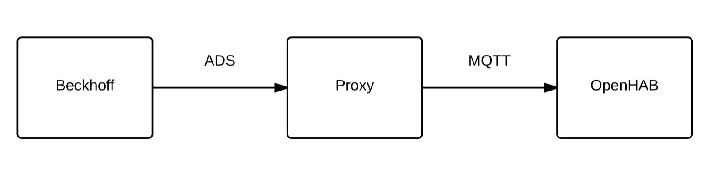

# ADS Proxy
ADS proxy will help me to control my PLC using MQTT. The main reason I need this is because I want to use OpenHAB in combination with my PLC (Beckhoff CX5020). With this little proxy and can use the existing MQTT binding to do this.

## Data flow diagram



## How to run
I personally run this on my server using [Dokku](http://progrium.viewdocs.io/dokku/). This makes it super easy to deploy a new version.

## Configuration
1. Enable ADS on your PLC project. To do this click on your task and then enable the checkbox before `Create symbols`.
Now under I/O Devices click on Image and go to the ADS tab. Check the `Enable ADS Server` and also `Create symbols`.
Download the new configuration and make sure you reboot your PLC.

2. Now add a static route to our Beckhoff PLC. The route should point to your server that will run the proxy application.
It's also a good idea to add an extra static route that points to your local development device. This way you can test out the proxy from your development device too.

3. Add an environment variable to your Dokku application that specifies the ADS source IP. This is the static route you've configured in the previous step.
```
dokku config:set node-js-app ADS_SOURCE_IP=192.168.1.117.1.1
```

## Debug
* View dokku logs `dokku logs node-js-app -t`
* Use [MQTT.fx](http://www.jensd.de/apps/mqttfx/) to debug MQTT messages

## Tests
Publish `hello` with value `.cToggleOfficeLight`

## Todo
* When stop PLC program connection is lost, when starting again the proxy doesn't work anymore because it lost connection
